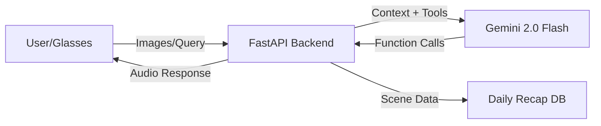

# Assistive Smart Glasses with Agentic AI

> **Research Prototype**: This project explores the application of multimodal Large Language Models (LLMs) as the cognitive engine for assistive wearable technology.

## Problem Statement
Visually impaired individuals face constant challenges in navigating and interpreting their environment. Traditional assistive technologies are often limited to specific tasks (e.g., color detection, currency reading) or lack context awareness. 

This research proposes a **universal visual agent** that sits on the user's face—a pair of smart glasses that "sees" for the user. By leveraging the reasoning capabilities of **Gemini 2.0 Flash**, the system moves beyond simple object detection to provide contextual understanding, temporal memory, and intelligent assistance.

## System Architecture

The system operates on a client-server architecture designed for low-latency interactions:

1.  **Hardware Hardware (Client)**: ESP32-based smart glasses with a camera module. Captures images on demand or periodically.
2.  **Backend (Server)**: A FastAPI-based orchestration layer (`glasses_backend`) that manages state and acts as the bridge between the hardware and the AI.
3.  **Cognitive Engine (AI)**: **Google Gemini 2.0 Flash**, employed via the Python SDK. This model functions as the "brain," processing visual and audio queries.

## Core Research Capabilities

This prototype demonstrates several key capabilities of agentic AI in assistive contexts:

### 1. Multimodal Reasoning & Function Calling
The system doesn't just "caption" images. It intelligently selects tools based on the user's natural language query. Analysis of `main.py` reveals the following autonomous behaviors:

*   **`recognize_face`**: Identifies known individuals with confidence scoring.
*   **`extract_text`**: Reads documents, signs, or screens (OCR).
*   **`describe_scene`**: Provides conversational, context-aware descriptions of the environment.
*   **`save_face`**: Oneshot learning—users can teach the AI new faces on the fly.
*   **`get_daily_recap`**: Retrieves and synthesizes past visual memories.

### 2. Temporal Memory (The "Daily Recap")
A significant innovation in this project is the **Daily Recap** feature (`scene_service.py`). The system passively or actively captures "scenes" throughout the day.
*   **Mechanism**: Images are timestamped and stored locally in `scenes/`.
*   **Synthesis**: When asked "What did I do today?", the agent retrieves relevant frames and constructs a chronological narrative of the user's day, effectively giving the user an external visual memory.

### 3. Natural Interaction
The system uses `strip_markdown` utilities to ensure that the AI's complex text output is sanitized for text-to-speech (TTS) engines, ensuring a smooth auditory experience for the user.

## Current Limitations & Future Work

While the prototype functions, several research challenges remain:

*   **Latency**: The request-response cycle is dependent on network conditions. Future work involves moving lightweight models to the edge (on-device).
*   **Privacy**: Currently, images are sent to the cloud API. A privacy-first approach would involve local processing or homomorphic encryption.
*   **Video Streaming**: The current implementation uses discrete frame snapshots. Integrating real-time video streaming with Gemini 1.5/2.0's long context window would provide fluid, continuous assistance.
*   **Memory Context**: The "Daily Recap" is currently file-based. Using a vector database for semantic search over a user's visual history would allow for complex queries like "Where did I leave my keys?" irrespective of *when* it happened.

## Setup & distinct configuration

1.  **Environment**:
    *   Python 3.10+
    *   Standard `requirements.txt` installation.
2.  **Configuration**:
    *   Create a `.env` file with `GOOGLE_API_KEY`.
3.  **Running**:
    *   `python run.py` starts the FastAPI server.

## Directory Structure
*   `glasses_backend/`: Core application logic.
    *   `main.py`: API Entry point and Agent definitions.
    *   `scene_service.py`: Memory and Scene management logic.
    *   `scenes/`: Local storage for temporal memory (Git-ignored).
